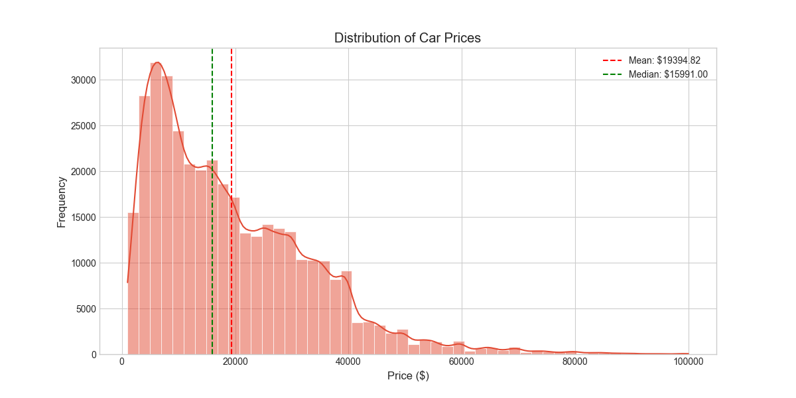
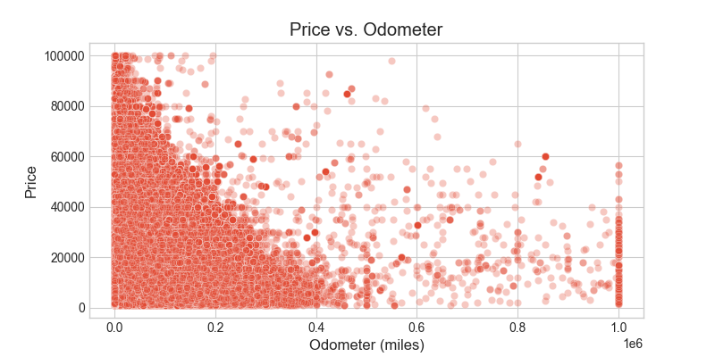
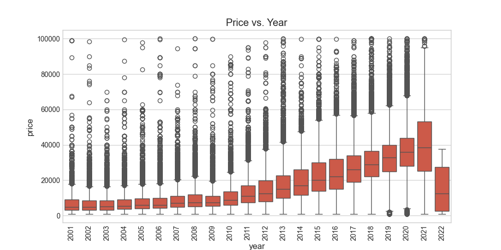
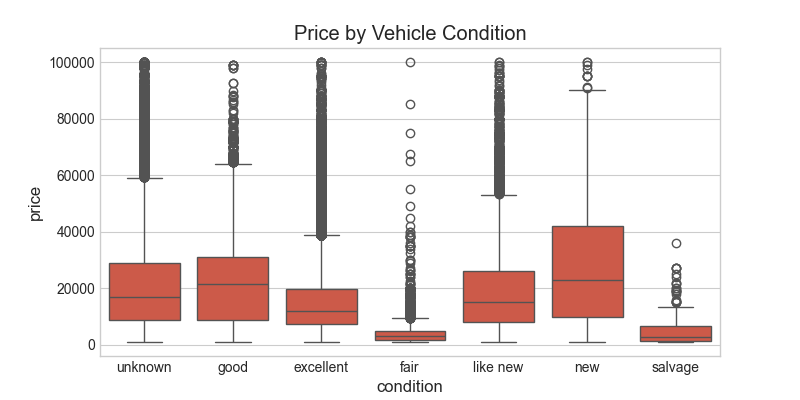
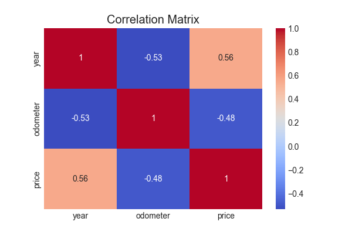

# MLAI-MOD11-PAA-02
## Module 11 Practical Application Assignment - 02

# What drives the price of a car?

## Overview

The purpose of this report is to analyze and identify the factors that influence a car price and provide clear recommendations to used car dealership as to what consumers value in a used car

## Data Description
- id – Unique listing ID
- region – Geographic region where the vehicle is listed
- price – Listing price of the vehicle (target variable)
- year – Manufacturing year of the vehicle
- manufacturer – Manufacturer/brand of the vehicle (e.g., Ford, Toyota)
- model – Specific model of the vehicle (e.g., Camry, Civic)
- condition – Condition of the vehicle (e.g., new, like new, excellent, good, fair, salvage)
- cylinders – Number of engine cylinders (e.g., 4 cylinders, 6 cylinders)
- fuel – Type of fuel used (e.g., gas, diesel, electric, hybrid)
- odometer – Mileage of the vehicle (in miles)
- title_status – Legal ownership status (e.g., clean, rebuilt, salvage)
- transmission – Transmission type (e.g., automatic, manual)
- VIN – Vehicle Identification Number
- drive – Drive type (e.g., 4wd, fwd, rwd)
- size – Size category of the vehicle (e.g., compact, full-size)
- type – Vehicle body type (e.g., SUV, truck, sedan)
- paint_color – Exterior color
- state – U.S. state where the vehicle is listed


## Key Findings
See Jupyter notebook for detailed analysis: [Data Analysis Report](prompt_II.ipynb)

## Data Analysis

### About the dataset
Structure:
- Total entries: 426,880
- Total columns: 18
- Data types: 2 numerical (int64), 2 float (float64), 14 categorical (object)

Key Fields with High Completeness:

- id, region, price, and state: 100% complete
- year, odometer, and transmission: >99% complete
- Columns with Missing Values:
- condition, cylinders, drive, size, paint_color, VIN: Varying levels of missingness
For example, condition is available for only ~59% of entries, and size for ~28%

Potential Data Quality Concerns:

- Several columns such as VIN and size have a high percentage of missing values, which may require imputation or exclusion depending on modeling goals.

- Some numeric fields (price, odometer) may contain outliers and require scaling or filtering.

### Key Findings and next steps for data preparation

#### 1. **Feature Assessment**
* **Drop Columns with high missing values**:
  * `size` (71.8%), `VIN` (37.7%) are strong candidates for dropping unless required for specific analysis.
* **Evaluate Business Importance**:
  * For `cylinders`, `condition`, `drive`, and `paint_color`, determine if these features are important for modeling. If yes, consider imputation strategies.

#### 2. **Data Imputation**
* **Categorical Imputation**:
  * Use the mode or a placeholder value like `"unknown"` for columns like `condition`, `cylinders`, and `paint_color`.
* **Numerical Imputation**:
  * Use median or mean for `odometer`, depending on its distribution.
* **Advanced Imputation**:
  * Consider using predictive models (e.g., KNN imputation) for features like `drive` or `cylinders` if they significantly affect price.

#### 3. **Data Cleaning**

* **Outlier Detection**:
  * Detect and handle price and odometer outliers before modeling.
* **Convert Data Types**:
  * Ensure appropriate data types (e.g., convert `year` to integer).

#### 4. **EDA and Correlation Analysis**
* Perform univariate and bivariate analysis to:
  * Understand distributions (histograms, box plots)
  * Identify correlations with target (`price`) using heatmaps and pairplots

#### 5. **Feature Engineering**
* Create useful derived features such as:
  * `car_age = current_year - year`
  * `price_per_mile = price / odometer`
  * Encode categorical features using one-hot or ordinal encoding as appropriate

## Data Preparation

**Drop columns**:
  - `size` (too sparse: >70% missing)
  - `VIN` (likely not needed for analysis and 38% missing)

**Fill missing categorical values with 'unknown'**
- Imputed missing categorical features with `"unknown"` label.

**Fill missing numerical values with median**
- Used median value to fill missing `odometer` and `year` fields.

**Remove outliers**
**Remove unrealistic prices and odometer readings**

The dataset is now free of missing values and ready for EDA and modeling.

## Exploratory data analysis

Lets analyze the dataset after cleaning up

### Distribution of car prices



- Most vehicles are priced between $5,000 and $20,000, with the peak frequency around $10,000 to $12,000.
- The distribution is right-skewed, indicating a larger number of lower-priced vehicles and a long tail of high-priced ones.
- Prices above $40,000 are rare, suggesting these are likely luxury or specialty vehicles.
- The smooth KDE line overlay confirms the unimodal shape and skewness.

### Price Vs Odometer

- This chart visualizes how a vehicle's mileage affects its price:
- There is a clear negative correlation: as mileage increases, price generally decreases.
- Most vehicles are priced under $30,000 and have odometer readings below 200,000 miles.
- Very few high-mileage vehicles (>400,000 miles) are listed at high prices—likely rare exceptions (e.g., commercial vehicles or luxury models).
- The dense cluster at low mileage and low-to-mid pricing indicates the sweet spot for typical used car inventory.
### Price Vs Year

- Newer vehicles consistently command higher prices. Median price increases steadily from older models (2001) to newer ones (2022).
- Vehicles manufactured after 2015 show a sharper upward trend in both median price and price variability.
- Interquartile ranges (IQRs) widen with newer models, indicating greater pricing variability—likely due to differences in model types and trim levels.
- Outliers are present across all years, especially at higher price points ($60K–$100K), reflecting luxury or rare vehicles.
- Cars from 2021 and 2022 have the highest median prices, but also show more variability, possibly due to market shifts during and after the COVID-19 pandemic.

### Price by Vehicle Condition (Boxplot)

- This boxplot highlights how listed condition affects price:
- Better condition means higher prices:
    - new and like new vehicles command the highest median and upper-range prices.
    - salvage and fair condition vehicles have significantly lower median prices, often under $10,000.
- ‘Good’ condition appears most common, with a wide price spread.
- The "unknown" group shows similar pricing behavior to “good” and “excellent,” suggesting possible misclassification or seller ambiguity.

### Correlation matrix


Newer cars are more expensive: As vehicle year increases, so does the price—this is expected since newer cars are generally more valuable.

Mileage reduces price: Vehicles with higher odometer readings tend to be priced lower, aligning with the common depreciation pattern in used vehicles.

Newer cars usually have less mileage: The negative correlation between year and odometer supports the logical trend that newer cars haven't been driven as much.

## Modeling
### Multiple regression models were developed and evaluated to predict used car prices:
#### Model Types:
- Linear Regression
- Ridge Regression (with L2 regularization)
- Lasso Regression (with L1 regularization)
- ElasticNet (with both L1 and L2 regularization)

#### Evaluation Framework:
-  Metrics: R² (primary),RMSE, MAE
-  Validation: 5-fold cross-validation
-  Hyperparameter Tuning: Grid search for optimization

```
Model Performance Comparison:
                      CV R² (mean)   Test R²    Test RMSE     Test MAE
Linear Regression              NaN  0.665555  8289.301025  5718.269544   
Ridge Regression          0.666278  0.665509  8289.870696  5718.537094   
Lasso Regression          0.666274  0.665516  8289.788071  5717.990537   
ElasticNet Regression     0.646892  0.644544  8545.724034  5878.980619   

```

#### Feature Importance Analysis:
The most influential factors affecting used car prices:
1. Vehicle Age: Newer vehicles command significantly higher prices
2. Odometer Reading: Lower mileage vehicles are more valuable
3. Manufacturer: Luxury brands (Mercedes-Benz, BMW, Audi) command price premiums
4. Condition: Excellent and good condition vehicles priced higher


## Findings

### Business Understanding
We set out to answer a key question for used car dealers:
- What are the most important factors that determine used car prices, and can we build a reliable model to help with inventory decisions?
- Our goal was to deliver clear, actionable insights to help you price, buy, and sell smarter.

## Data Cleaning & Preparation
- Removed outliers and corrected obvious errors in price, year, and odometer readings.
- Addressed missing values and standardized data types.
- Selected features that most impact price based on data completeness and domain relevance.

---

## Statistical Insights
- **Descriptive statistics:** Most cars are from 2008–2017, with mileage typically under 135,000 miles.
- **Brand distribution:** Ford, Chevrolet, and Toyota are the most common.
- **Condition:** Most cars are in “good” or “excellent” shape; “salvage” and “new” are rare.

---

## Key Findings & Actionable Items

- **Year:** Newer vehicles sell for significantly more.
- **Odometer:** Lower mileage = higher price. Mileage is one of the top predictors.
- **Condition:** “New” and “excellent” cars earn the best prices. “Salvage” and “unknown” fetch much less.
- **Brand:** Luxury brands (e.g., Ferrari, Tesla) bring a premium; economy brands (e.g., Kia, Mitsubishi) are more affordable.

**What should you do?**
- **Buy smart:** Focus on newer, low-mileage, well-maintained cars.
- **Sell smart:** Highlight the best features (condition, brand) in your ads.
- **Price smart:** Set realistic prices for high-mileage or salvage vehicles to move them quickly.

---

## Model Performance
- Our models explain about **64% of price variation**—strong for real-world data.
- Typical prediction error is **$5,800–$8,600**, which is reasonable given the market’s unpredictability.
- Linear, Ridge, and Lasso models all performed about the same.

---

## Next Steps & Recommendations

- **Minor improvements:** Add more features (e.g., accident history), segment by car type, or try advanced models for even better predictions.
- **Data quality:** Continue ensuring your inventory data is accurate and well-maintained.
- **Ongoing analysis:** We can help break down results further by region, time, or other factors as your business grows.

---


